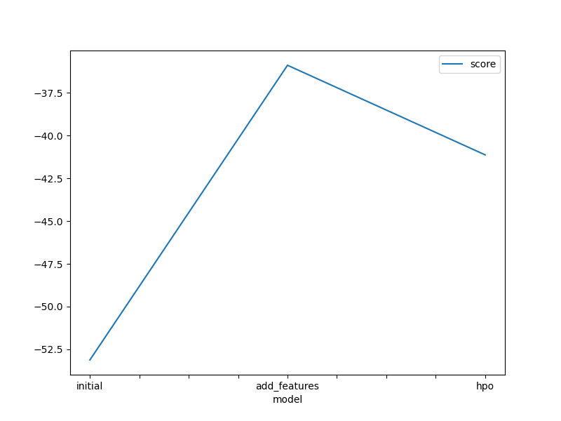
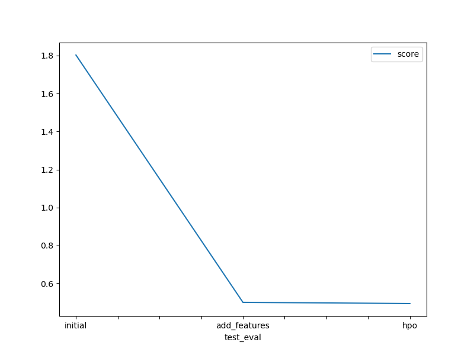

# Report: Predict Bike Sharing Demand with AutoGluon Solution
#### Guy Ahonakpon GBAGUIDI

## Initial Training
### What did you realize when you tried to submit your predictions? What changes were needed to the output of the predictor to submit your results?

When I submitted the initial predictions to the Kaggle model, it did not perform as well as expected. I realized the need for feature engineering for better results.

During the initial training phase, I carefully inspected the predictions, aiming to identify any negative values. Fortunately, all the values turned out to be positive, negating the necessity of adjusting any values to zero before submission. Additionally, I considered converting the count column to int64 from float32. However, given that the competition's metric is root mean square logarithmic error for regression, I concluded that this conversion step was unnecessary for the output.

### What was the top ranked model that performed?

The highest-performing model, with the lowest root mean square error (RMSE), was the `Weighted_Ensemble_L3` model with a score of `0.49467`. This model is a stacked ensemble composed of three layers of previously trained models. The stacking process was designed to achieve the highest possible validation accuracy, resulting in its top-ranked position.

## Exploratory data analysis and feature creation
### What did the exploratory analysis find and how did you add additional features?

For feature creation, I created 4 new features with `datetime` column including hour, day, month, and year. Additionally, I converted the season and weather columns to categorical columns. I deleted `atemp` column because of high correlation with `temp`.

### How much better did your model preform after adding additional features and why do you think that is?

After incorporating additional features and categorized data, my model exhibited significant performance improvement. The Kaggle score of root_mean_square_error (RMSE) decreased substantially, indicating a superior result of `0.50104`, compared to the initial value of `1.8029`. This enhancement can be attributed to the fact that the extra features and categorized data provided more valuable information, enabling the model to better comprehend the underlying patterns connecting the features and the target variable. Consequently, the model's ability to learn and make accurate predictions improved significantly.

## Hyper parameter tuning
### How much better did your model preform after trying different hyper parameters?

Hyperparameter tuning proved to be beneficial in certain cases; however, the overall improvement in model performance was rather limited. While some configurations yielded positive results, others had a detrimental impact on the model's performance.

### If you were given more time with this dataset, where do you think you would spend more time?

In my opinion, prioritizing feature engineering and the discovery of new features deserves more attention in the model development process. While hyperparameter tuning is undoubtedly crucial for achieving the best model performance, the results have shown that even a simple addition, such as including the "hour" feature, led to a significant increase in performance without fine-tuning the models used by autogluon.

Therefore, I believe that dedicating more time to feature engineering upfront can yield substantial gains in performance before diving into extensive hyperparameter optimization. By focusing on extracting meaningful insights from the data and creating relevant features, we can potentially uncover valuable patterns and relationships that the models can leverage to make better predictions. Once the feature engineering stage has been thoroughly explored, fine-tuning the hyperparameters can serve as a powerful refinement step to further optimize the models' performance. This sequential approach can lead to more efficient and effective model development.

### Create a table with the models you ran, the hyperparameters modified, and the kaggle score.
|model|hpo1|hpo2|hpo3|score|
|--|--|--|--|--|
|initial|default_params|default_params|default_params|1.80290|
|add_features|default_params|default_params|default_params|0.50104|
|hpo|{'num_boost_round': 100, 'num_leaves': Int: lower=26, upper=66}|{'num_epochs': 15, 'learning_rate': Real: lower=0.0001, upper=0.01, 'activation': ['relu', 'softrelu', 'tanh'], 'dropout_prob': Real: lower=0.0, upper=0.5}|GBM: num_boost_round: 100|0.49467|

### Create a line plot showing the top model score for the three (or more) training runs during the project.

TODO: Replace the image below with your own.

### Create a line plot showing the top kaggle score for the three (or more) prediction submissions during the project.

TODO: Replace the image below with your own.

## Summary

In conclusion, the project effectively demonstrated the significance of both feature engineering and hyperparameter optimization in the machine learning workflow. It revealed an iterative approach, wherein we continuously alternate between extracting new features from the provided data, conducting exploratory data analysis (EDA), and experimenting with different models using the newly engineered features. This iterative process persists until we attain a satisfactory level of validation and test errors, enhancing the model's performance step by step.